# README id_check.py 

Module that holds all functions for checking an INE id.

## List of functions

1. `check_id_text()`
2. `check_id_img()`
3. `get_qr()`
4. `query_qr()`
5. `clean_qr_response()`
6. `prep_img()`
7. `ocr_img()`
8. `proc_ocr_text()`
9. `query_web()`
10. `proc_web_response()`
11. `get_id_type()`
12. `proc_text()`

## Process Flow

### Flowchart

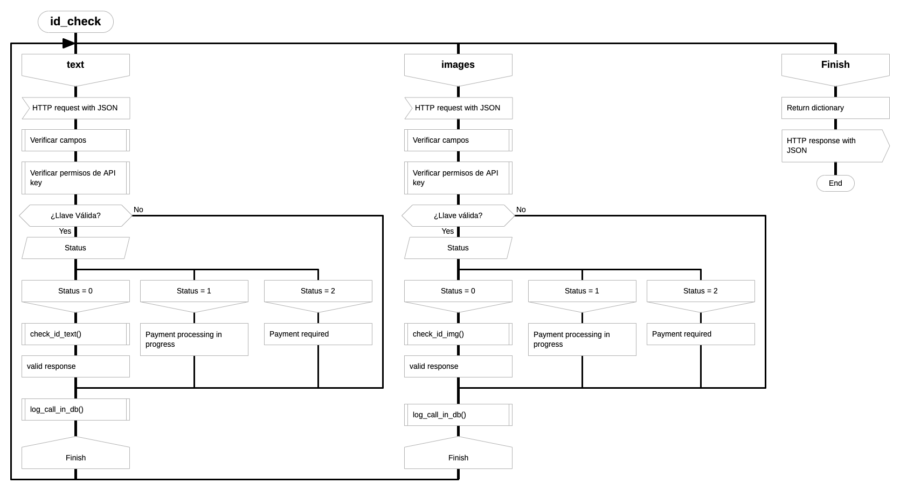

### Text representation

- `check_id_text()`
	- `query_web()`
	- `proc_web_response()`
- `check_id_image()`
	- `get_qr()`
	- `query_qr()`
	- `clean_qr_response()`
	- `prep_img()`
	- `ocr_img()`
	- `proc_ocr_text()`
	- `check_id_text()`
	- `get_id_type()`
	- `proc_text()`

## Description of functions

### 1. `check_id_text()`

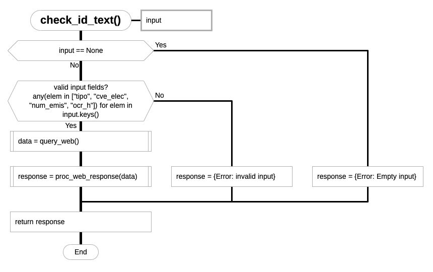

Wrapper function, receives a dictionary of ID fields and an API key and
calls INE website, breaks a captcha, gets and processes the website 
response. returns a dictionary of the response (as HTML) and a boolean field

### 2. `check_id_img()`

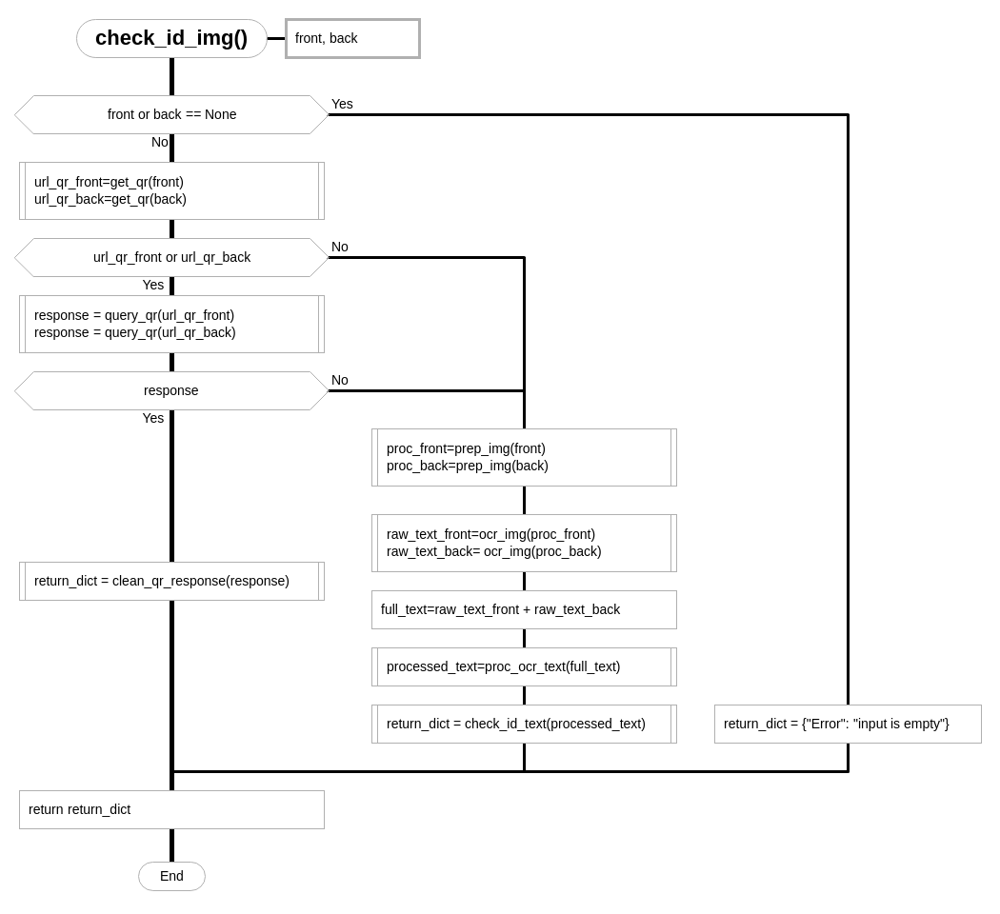

Wrapper function, receives ID images, front and back, and an API key. First
tries to extract a QR code, call the URL encoded in the QR and if successful
gets the response processes it and exits, if unsuccessful, it does image processing,
OCR, some text processing operations to the extracted text and then calls
check_id_text.

### 3. `get_qr()`

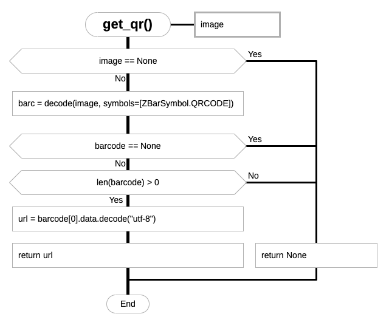

QR detector and extractor, receives an image and if successful returns an
URL, on failure returns None.

### 4. `query_qr()`

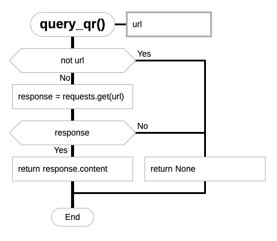

Simple web caller that receives an URL and calls it, returns the HTML response

### 5. `clean_qr_response()`

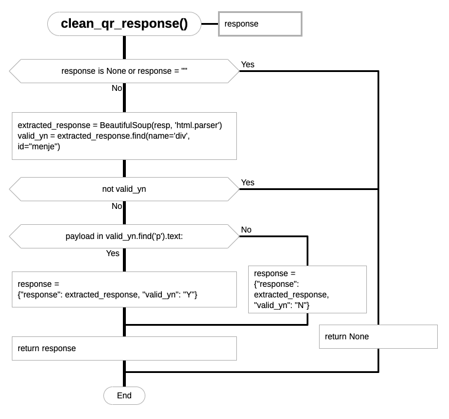

This function receives the HTML response from calling the URL encoded in the QR
and does the extraction of information to see if the ID is valid and codes it as
a Boolean field.

### 6. `prep_img()`

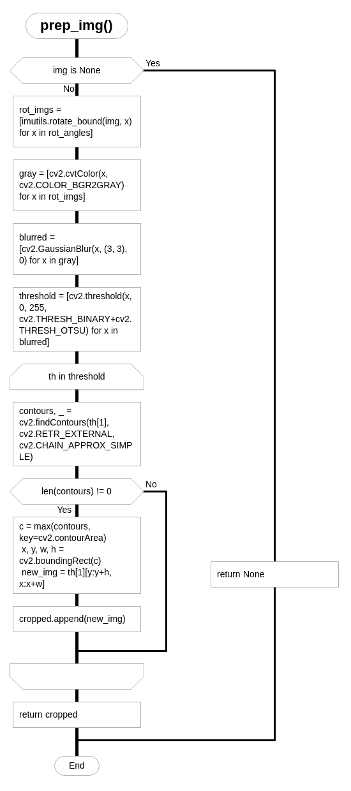

Image processing steps, this function receives an image and does the following:

- binarization
- Denoising
- Filtering
- Edge detection
- Perspective warping
It receives an image and returns the processed image

### 7. `ocr_img()`

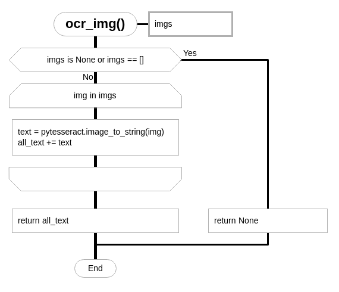

Calls tesseract on a processed image
receives an image and returns a string

### 8. `proc_ocr_text()`

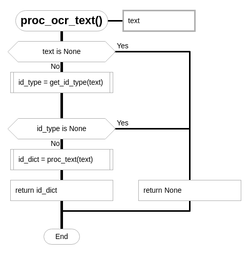
Receives a string and returns a dictionary containing the ID fields and the
ID type

### 9. `query_web()`

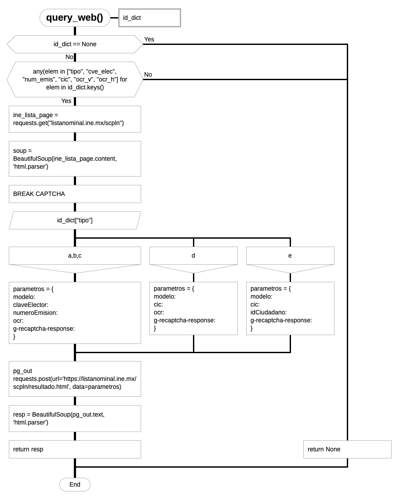

Simple web caller that receives a dictionary of data, fills a form and 
calls the INE website, returns the HTML response

### 10. `proc_web_response()`

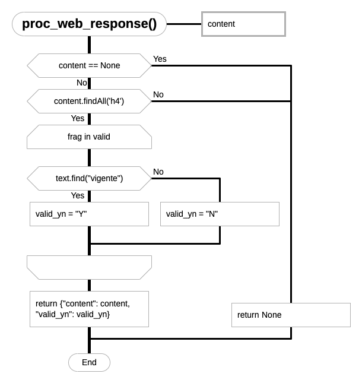

Receives a raw HTML response from INE and extracts if the ID is valid as a
Boolean value, returns its input and the extracted value as a dictionary

### `get_id_type()`

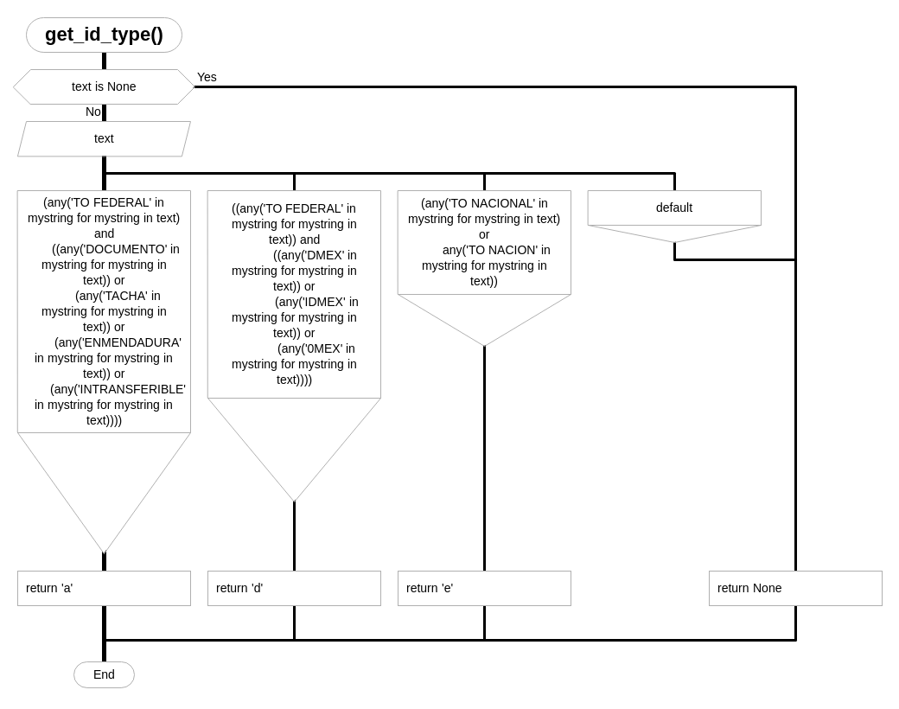

### `proc_text()`

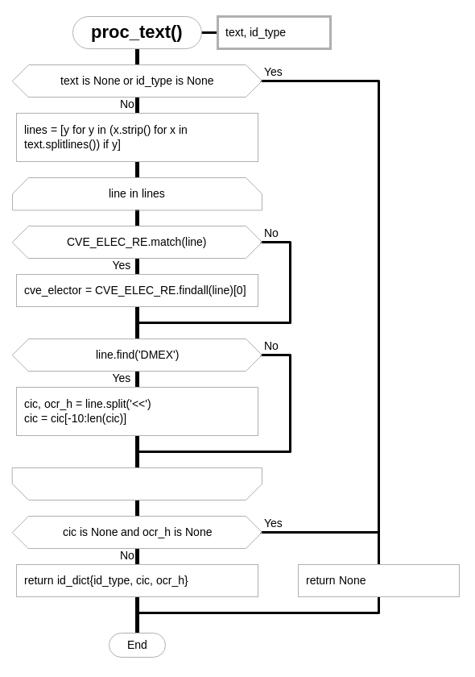