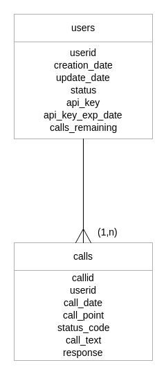

# ID-CHECK-API

API RESTful para comprobación de INE, hecha con python, Flask y PostgreSQL.

## Autor

Motoko Research

## Fecha de creación 

2019-12-16

## Dependencias

- Ubuntu Linux 18.04 LTS
- Python 3
- venv
- PostgreSQL 10
- SQLite 3 (testing)
- Flask
- Flask-restful
- SQLAlchemy
- psycopg2
- gunicorn
- NGinx

## Instalación

1. Crear una carpeta para el repositorio
2. Crear un ambiente virtual `python3.6 -m venv venv`
3. Activarlo `source venv/bin/activate`
4. Crear base de datos en SQLite `sqlite3 id-check-db.sqlite < id-check-db.sql`
5. Instalar dependencias `pip install -r requirements.txt`

```pip install Flask Flask-restful SQLAlchemy psycopg2``` 

como sudo 
apt-get update
apt-get install -y libsm6 libxext6 libxrender-dev

como el user y en venv
pip install opencv-python

afuera
sudo apt-get install zbar-tools
apt-get update && \
    apt-get install -y build-essential libzbar-dev && \
    
en venv
pip install zbar
(continuar aunque de un error en instalacion)

afuera

sudo apt-get update
sudo apt-get install tesseract-ocr
sudo apt-get install libtesseract-dev

sudo apt-get -y install supervisor nginx git
 
 (venv) $ pip install gunicorn pymysql
 
 
 
## Endpoints

- users:Permite crear y consultar usuarios 
- check-ids: Analiza las imágenes  

## Estructura de archivos

```
id_check_api/
    README.md
    venv/
    app.py
    wsgi.py
    requirements.txt
```

## Formato de las llamadas

### users

GET a users/userid lista la fecha de creacion del usuario, y la fecha de
terminación del servicio, fecha de ultimo pago y llamadas restantes  

POST a users crea un usuario y devuelve el userid y el API key

### check-ids

GET a check-ids analiza la imagen (terminado el análisis borra las imágenes) 

## Modo de uso 

### Creación de un nuevo usuario

```
curl -X POST http://localhost:5000/api/v1/users
```

### Consultar usuario

```
curl 127.0.0.1:5000/api/v1/users/1
```

### Analizar INE

```
curl -d '{"api_key":"B7AX0KEmUXUwhKO8MjBxFw6VJ-PzNMCp", "front":"value2", "back":"value3"}' -H "Content-Type: application/json" -X POST http://localhost:5000/api/v1/id-check
```


## Algoritmo

Para encriptacion vamos a usar 2 extensiones de postgresql pgcrypto y chkpass las
cuales son estandar en las distribuciones de postgres-contrib. 
Con chkpass vamos a encriptar las llaves de la API y con pgcrypto vamos a generar
encriptacion simetrica de la llamada y la respuesta, esto para cumplir con las 
politicas de privacidad.
Las llaves de usuario son generadas aleatoriamente para cada usuario utilizando
pgcrypto con el generador v4, esto nos da llaves aleatorias y unicas.

### Esquema de las tablas utilizadas



